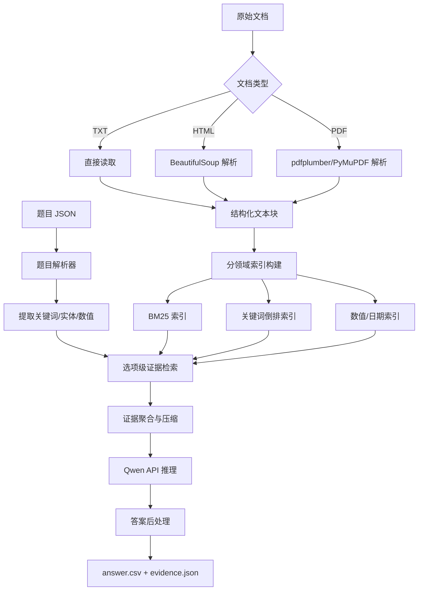

# AFAC2026 赛题四 Baseline 方案

## 一、赛题核心分析

### 1.1 任务定义

构建一个**金融长文本 Agent**，在禁止 embedding 模型、限制 Token 成本、只能调用 Qwen API 的条件下，准确回答 5 个金融领域的客观题（单选/多选/判断）。

### 1.2 评分公式

```
FinalScore = 100 × Accuracy × (0.7 + 0.3 × TokenScore)
TokenScore = max(0, min(1, (5,000,000 - TotalTokens) / 5,000,000))
```

**核心结论**：准确率是主体得分来源（占 70%+），Token 效率最多影响 30% 的加权系数。

### 1.3 官方 Baseline 分析

| 指标 | 官方 Baseline |
|---|---|
| 准确率 | 17% (A榜) |
| Token 消耗 | 3,628,186 |
| FinalScore | ≈ 13.3 |

**官方 Baseline 失败原因**：直接将全文输入模型，导致上下文过长、关键信息被稀释，模型无法有效定位答案。

### 1.4 关键约束

- ❌ 禁止使用 embedding 模型
- ❌ 禁止修改基座模型参数
- ✅ 可使用 Python PDF 解析库离线预处理（不计 Token）
- ✅ 可使用 BM25、关键词检索、规则检索
- ✅ 只能通过阿里云百炼平台或魔搭社区调用 Qwen 系列模型 API

---

## 二、数据集深度分析

### 2.1 文档结构全貌

| 领域 | 文档数 | 文档格式 | 文档特点 | doc_id 规律 |
|---|---|---|---|---|
| `insurance` | 16 | PDF (100KB~1MB) | 保险条款，结构化强 | 数字 `1`~`16` |
| `regulatory` | 26 | HTML + PDF + TXT | 证监会令/人行令 | `csrc_XXXX` / `strict_v3_XXX` |
| `financial_contracts` | 14 | PDF (1MB~13MB) | 债券募集说明书，极长 | `textXX` |
| `financial_reports` | 10 | PDF (2MB~30MB) | 年报，含财务表格 | `annual_公司_年份_report` |
| `research` | 20 | PDF | 行业研报 | `pack2_textXX` |

### 2.2 doc_id → 文件路径完整映射

```
BASE = /apdcephfs_tj5/share_303697531/ricardogrli/AFAC-4/public_dataset_upload/raw
```

| 领域 | doc_id 格式 | 文件路径 | 格式 |
|---|---|---|---|
| insurance | `1` ~ `16` | `{BASE}/insurance/{doc_id}.pdf` | PDF |
| financial_reports | `annual_byd_2024_report` 等 | `{BASE}/financial_reports/{doc_id}.PDF` | PDF |
| financial_contracts | `text01` ~ `text14` | `{BASE}/financial_contracts/{doc_id}.pdf` | PDF |
| research | `pack2_text01` ~ `pack2_text20` | `{BASE}/research/{doc_id}.pdf` | PDF |
| regulatory (人行令) | `strict_v3_XXX_...` | `{BASE}/regulatory/txt/{doc_id}.txt` | **TXT** ✅ |
| regulatory (证监会主文) | `csrc_XXXX` | `{BASE}/regulatory/html/{doc_id}.html` | HTML |
| regulatory (附件) | `csrc_XXXX_attN` | `{BASE}/regulatory/attachments/{doc_id}.pdf` | PDF |

**关键发现**：`strict_v3` 系列有纯 TXT 文件，可直接读取，零依赖、质量最高。

### 2.3 题目特征分析

**保险（insurance）- 20题**：
- 题型：计算题、逻辑推理、比较分析、事实查询
- 特点：跨 2~4 份保险条款对比
- 关键信息：免赔额、等待期、保险金计算公式、免责条款、退保规则

**监管法规（regulatory）- 20题**：
- 题型：多选题、判断题、单选题
- 特点：数字细节多（时限、金额门槛）
- 关键信息：30个工作日、6个月、1年、7日、10日等时限

**财务报告（financial_reports）- 20题**：
- 题型：跨年度/跨公司数值对比
- 特点：文件极大（最大 30MB），需精准定位
- 关键信息：营业收入、净利润、研发投入比例、现金流、分红方案

**金融合同（financial_contracts）- 20题**：
- 题型：条款理解、条件判断
- 特点：文件极大（最大 13MB），债券募集说明书
- 关键信息：发行人信息、债券要素、评级、权利义务

**研报（research）- 20题**：
- 题型：数字核验、行业趋势判断
- 特点：大量涉及具体数字（市场规模、增速、比例）
- 关键信息：精确数值匹配

---

## 三、整体架构设计

### 3.1 系统流程图



### 3.2 两阶段划分

| 阶段 | 是否计 Token | 核心任务 |
|---|---|---|
| 阶段一：离线预处理 | ❌ 不计 | 文档解析、切块、索引构建 |
| 阶段二：在线推理 | ✅ 计入 | 证据检索、Qwen 推理、答案生成 |

---

## 四、阶段一：离线文档预处理

### 4.1 文档解析策略

#### 4.1.1 regulatory（监管法规）

**TXT 文件（strict_v3 系列）**：
```python
# 直接读取，零依赖
with open(path, 'r', encoding='utf-8') as f:
    text = f.read()
```

**HTML 文件（csrc 系列）**：
```python
from bs4 import BeautifulSoup
soup = BeautifulSoup(html, 'html.parser')
# 提取 .detail-news 区域的正文
content = soup.find('div', class_='detail-news').get_text()
```

**PDF 附件（csrc_XXXX_attN）**：
```python
import pdfplumber
with pdfplumber.open(path) as pdf:
    text = '\n'.join(page.extract_text() for page in pdf.pages)
```

#### 4.1.2 insurance（保险条款）

```python
import pdfplumber
with pdfplumber.open(path) as pdf:
    for page in pdf.pages:
        text = page.extract_text()
        # 识别条款编号（第X条）
        # 提取数字（百分比、金额、天数）
        # 标记关键词（免赔额、等待期、保险金、免责）
```

#### 4.1.3 financial_reports（财务报告）

```python
# 重点提取前 10-20 页（财务摘要）
# 以及利润分配方案、研发投入相关页面
import pdfplumber
with pdfplumber.open(path) as pdf:
    # 策略：先提取前20页（财务摘要）
    # 再全文搜索关键词定位其他关键页面
    for page in pdf.pages[:20]:
        text = page.extract_text()
        tables = page.extract_tables()
```

#### 4.1.4 financial_contracts（金融合同）

```python
# 文件极大，按章节切分
# 重点提取：发行人信息、债券要素、评级信息
import pdfplumber
with pdfplumber.open(path) as pdf:
    for page in pdf.pages:
        text = page.extract_text()
        # 按章节标题切分
```

#### 4.1.5 research（行业研报）

```python
import pdfplumber
with pdfplumber.open(path) as pdf:
    for page in pdf.pages:
        text = page.extract_text()
        # 重点提取包含数字的段落
```

### 4.2 文本切块策略

```python
class Chunk:
    doc_id: str          # 文档ID
    page_num: int        # 页码
    section_title: str   # 章节标题
    text: str            # 文本内容（500~1000字）
    numbers: list        # 提取的数字列表
    keywords: list       # 提取的关键词列表
```

切块规则：
- 按段落/条款自然切分
- 每个 chunk 控制在 500~1000 字
- 保留上下文重叠（前后各 50 字）
- 保留章节标题作为元数据

### 4.3 索引构建

#### BM25 索引
```python
from rank_bm25 import BM25Okapi
import jieba

# 对所有 chunk 分词后建立 BM25 索引
tokenized_chunks = [list(jieba.cut(chunk.text)) for chunk in all_chunks]
bm25 = BM25Okapi(tokenized_chunks)
```

#### 关键词倒排索引
```python
# 金融术语 → chunk_id 列表
keyword_index = defaultdict(list)
for chunk_id, chunk in enumerate(all_chunks):
    for keyword in extract_financial_terms(chunk.text):
        keyword_index[keyword].append(chunk_id)
```

#### 数值索引
```python
# 数字 → chunk_id 列表
number_index = defaultdict(list)
for chunk_id, chunk in enumerate(all_chunks):
    for num in chunk.numbers:
        number_index[num].append(chunk_id)
```

#### 条款号索引（regulatory/insurance 专用）
```python
# "第X条" → chunk_id
clause_index = {}
for chunk_id, chunk in enumerate(all_chunks):
    clauses = re.findall(r'第[一二三四五六七八九十百千\d]+条', chunk.text)
    for clause in clauses:
        clause_index[clause] = chunk_id
```

---

## 五、阶段二：在线推理流程

### 5.1 题目解析

```python
def parse_question(q):
    """解析题目，提取检索所需的关键信息"""
    # 提取题干关键词
    keywords = extract_keywords(q['question'])
    # 提取选项中的关键词
    option_keywords = {k: extract_keywords(v) for k, v in q['options'].items()}
    # 提取数字
    numbers = extract_numbers(q['question'] + str(q['options']))
    # 提取时间/日期
    dates = extract_dates(q['question'])
    # 提取产品名/公司名/法规名
    entities = extract_entities(q['question'] + str(q['options']))
    return keywords, option_keywords, numbers, dates, entities
```

### 5.2 选项级证据检索

**核心思路**：不是对整个题目检索一次，而是对每个选项分别检索，再合并去重。

```python
def retrieve_evidence(question, options, doc_ids, domain):
    """选项级证据检索"""
    all_evidence = []
    
    # 1. 限定文档范围（A榜有 doc_ids）
    candidate_chunks = filter_by_doc_ids(doc_ids)
    
    # 2. 题干检索
    stem_results = bm25_search(question, candidate_chunks, top_k=3)
    all_evidence.extend(stem_results)
    
    # 3. 每个选项分别检索
    for opt_key, opt_text in options.items():
        query = question + " " + opt_text
        opt_results = bm25_search(query, candidate_chunks, top_k=3)
        all_evidence.extend(opt_results)
    
    # 4. 数字精确匹配补充
    numbers = extract_numbers(question + str(options))
    for num in numbers:
        if num in number_index:
            num_chunks = [c for c in number_index[num] if c in candidate_chunks]
            all_evidence.extend(num_chunks[:2])
    
    # 5. 合并去重，按相关性排序
    evidence = deduplicate_and_rank(all_evidence)
    
    # 6. 控制总证据长度（2000~3000字）
    evidence = truncate_evidence(evidence, max_chars=3000)
    
    return evidence
```

### 5.3 证据压缩策略

当检索到的证据过长时，采用零 Token 消耗的压缩方案：

```python
def compress_evidence(evidence_text, question, options):
    """基于关键词相关性的零Token压缩"""
    # 提取题目中的所有关键词
    all_keywords = extract_all_keywords(question, options)
    
    # 按句子切分证据
    sentences = split_sentences(evidence_text)
    
    # 保留包含关键词的句子
    relevant_sentences = []
    for sent in sentences:
        if any(kw in sent for kw in all_keywords):
            relevant_sentences.append(sent)
    
    return '\n'.join(relevant_sentences)
```

### 5.4 Qwen 推理 Prompt 设计

```python
SYSTEM_PROMPT = """你是金融文档分析专家。请严格基于以下证据回答问题，不得使用证据之外的知识。
请逐项分析每个选项是否正确，然后给出最终答案。"""

def build_prompt(question, options, evidence, answer_format):
    """构建推理 Prompt"""
    # 题型说明
    format_hint = {
        'mcq': '【单选题】请从A/B/C/D中选择唯一正确答案。',
        'multi': '【多选题】请从A/B/C/D中选择所有正确答案，按字母顺序输出（如ABC）。',
        'tf': '【判断题】请判断陈述是否正确，输出A或B。'
    }
    
    prompt = f"""证据材料：
{evidence}

---

{format_hint[answer_format]}

题目：{question}

选项：
A. {options['A']}
B. {options['B']}
{'C. ' + options.get('C', '') if 'C' in options else ''}
{'D. ' + options.get('D', '') if 'D' in options else ''}

请逐项分析每个选项，最后在最末行单独输出答案字母。"""
    
    return prompt
```

### 5.5 答案后处理

```python
def normalize_answer(raw_answer, answer_format):
    """从模型输出中提取规范化答案"""
    # 尝试从最后一行提取
    last_line = raw_answer.strip().split('\n')[-1]
    letters = re.findall(r'[A-D]', last_line.upper())
    
    if not letters:
        # 兜底：从全文提取
        letters = re.findall(r'[A-D]', raw_answer.upper())
    
    if answer_format == 'mcq':
        return letters[0] if letters else 'A'
    elif answer_format == 'multi':
        return ''.join(sorted(set(letters))) if letters else 'A'
    elif answer_format == 'tf':
        return letters[0] if letters and letters[0] in ['A', 'B'] else 'A'
```

---

## 六、各领域特化策略

### 6.1 保险条款（insurance）

| 策略 | 说明 |
|---|---|
| 产品名称索引 | `{平安智盈金生→doc1, 国寿增益宝→doc2, ...}` |
| 计算题处理 | 提取公式和数值，让 Qwen 做计算 |
| 比较分析题 | 同时检索多份条款的同一字段（如"身故保险金"） |
| 免责条款检索 | 专门索引"责任免除"章节 |

### 6.2 监管法规（regulatory）

| 策略 | 说明 |
|---|---|
| 时限词典 | `{30个工作日, 6个月, 1年, 7日, 10日...}` |
| 条文号索引 | 第X条/第X款 → 对应文本 |
| 判断题策略 | 拆分为两个子条件，分别检索验证 |
| TXT 优先 | strict_v3 系列直接读 TXT，质量最高 |

### 6.3 财务报告（financial_reports）

| 策略 | 说明 |
|---|---|
| 财务摘要优先 | 优先检索前 5-10 页（主要财务指标表） |
| 指标词典 | `{营业收入, 净利润, 研发投入, 现金流, 分红...}` |
| 跨年度对比 | 同时检索两份年报的同一指标 |
| 表格提取 | 用 pdfplumber 提取财务数据表格 |

### 6.4 金融合同（financial_contracts）

| 策略 | 说明 |
|---|---|
| 精准检索 | 文件极大，必须精准定位，不能全文输入 |
| 章节索引 | 按章节标题建立索引 |
| 重点字段 | 发行人、债券名称、利率、期限、评级 |

### 6.5 研报（research）

| 策略 | 说明 |
|---|---|
| 数字精确匹配 | 题目中的数字直接在文本中搜索 |
| 百分比检索 | "56%"、"2500亿元" 等精确匹配 |
| 公司/行业名索引 | 按公司名和行业名建立索引 |

---

## 七、Token 控制策略

### 7.1 Token 预算分配

```
Token 预算总额：5,000,000
A 榜题目数：100

每题平均可用 Token：50,000（远超实际需要）

实际每题预估消耗：
  - 证据输入：~3,000 tokens
  - 题目+选项：~500 tokens
  - 系统提示：~200 tokens
  - 模型输出：~300 tokens
  - 合计：~4,000 tokens/题

100 题总计：~400,000 tokens
TokenScore = (5,000,000 - 400,000) / 5,000,000 = 0.92
```

### 7.2 Token 节约原则

1. **不要全文输入**：任何文档都不要整体输入，只输入检索到的证据段落
2. **不要多轮对话**：每道题一次 API 调用完成
3. **复用解析结果**：同一文档的多道题复用离线解析缓存
4. **控制输出长度**：Prompt 中明确要求简洁输出
5. **离线做重活**：文档解析、切块、索引全部离线完成（不计 Token）

### 7.3 Token 统计实现

```python
class TokenCounter:
    def __init__(self):
        self.records = {}  # qid -> {prompt_tokens, completion_tokens, total_tokens}
        self.total_prompt = 0
        self.total_completion = 0
    
    def record(self, qid, response):
        usage = response.usage
        self.records[qid] = {
            'prompt_tokens': usage.prompt_tokens,
            'completion_tokens': usage.completion_tokens,
            'total_tokens': usage.total_tokens
        }
        self.total_prompt += usage.prompt_tokens
        self.total_completion += usage.completion_tokens
    
    def generate_csv(self, answers):
        """生成 answer.csv"""
        rows = [['qid', 'answer', 'prompt_tokens', 'completion_tokens', 'total_tokens']]
        # summary 行
        rows.append(['summary', '', self.total_prompt, self.total_completion, 
                     self.total_prompt + self.total_completion])
        # 每题一行
        for qid, answer in answers.items():
            r = self.records[qid]
            rows.append([qid, answer, r['prompt_tokens'], r['completion_tokens'], r['total_tokens']])
        return rows
```

---

## 八、doc_id 路径映射实现

```python
import os

RAW_BASE = "/apdcephfs_tj5/share_303697531/ricardogrli/AFAC-4/public_dataset_upload/raw"

def resolve_doc_path(doc_id: str, domain: str) -> tuple:
    """
    返回 (文件路径, 文件类型)
    文件类型: 'txt' | 'html' | 'pdf'
    """
    if domain == "insurance":
        return f"{RAW_BASE}/insurance/{doc_id}.pdf", "pdf"

    elif domain == "financial_reports":
        path = f"{RAW_BASE}/financial_reports/{doc_id}.PDF"
        if not os.path.exists(path):
            path = f"{RAW_BASE}/financial_reports/{doc_id}.pdf"
        return path, "pdf"

    elif domain == "financial_contracts":
        return f"{RAW_BASE}/financial_contracts/{doc_id}.pdf", "pdf"

    elif domain == "research":
        return f"{RAW_BASE}/research/{doc_id}.pdf", "pdf"

    elif domain == "regulatory":
        # strict_v3_XXX 系列 → txt（最优质）
        if doc_id.startswith("strict_v3_"):
            txt_dir = f"{RAW_BASE}/regulatory/txt"
            for fname in os.listdir(txt_dir):
                if fname.startswith(doc_id):
                    return f"{txt_dir}/{fname}", "txt"

        # csrc_XXXX_attN → pdf 附件
        elif "_att" in doc_id:
            return f"{RAW_BASE}/regulatory/attachments/{doc_id}.pdf", "pdf"

        # csrc_XXXX → html 主文
        else:
            return f"{RAW_BASE}/regulatory/html/{doc_id}.html", "html"

    return None, "unknown"
```

---

## 九、预期效果评估

### 9.1 各方案对比

| 方案 | 预期准确率 | 预期 Token 消耗 | TokenScore | FinalScore |
|---|---|---|---|---|
| 官方 Baseline（全文输入） | 17% | 3,628,186 | 0.27 | ≈ 13.3 |
| **本方案 Baseline** | **40~55%** | **~400,000** | **0.92** | **≈ 39~54** |
| 优化后 | 65~75% | ~600,000 | 0.88 | ≈ 62~72 |

### 9.2 各领域预期难度

| 领域 | 预期准确率 | 主要挑战 |
|---|---|---|
| regulatory | 55~70% | TXT 直接可读，数字匹配即可 |
| insurance | 40~55% | 计算题需要精确公式提取 |
| research | 40~55% | 数字核验型，精确匹配有效 |
| financial_reports | 35~50% | 大文件，表格提取质量关键 |
| financial_contracts | 30~45% | 文件最大，信息最分散 |

---

## 十、实施计划

### 10.1 优先级排序

```
第一步（Day 1）：基础设施
  ✅ 建立 doc_id → 文件路径完整映射表
  ✅ 验证所有 doc_id 都能找到对应文件
  ✅ 实现 Qwen API 调用封装 + Token 统计

第二步（Day 2-3）：文档解析
  ✅ 实现 TXT/HTML/PDF 三种格式的解析器
  ✅ 实现文本切块（按段落/条款）
  ✅ 构建 BM25 + 关键词 + 数值索引

第三步（Day 4）：检索与推理
  ✅ 实现选项级证据检索
  ✅ 实现证据聚合与压缩
  ✅ 实现 Qwen API 调用 + 答案后处理

第四步（Day 5）：端到端验证
  ✅ 跑通 100 道 A 榜题目
  ✅ 生成 answer.csv 和 evidence.json
  ✅ 分析错题，定位薄弱环节

第五步（持续优化）：
  ✅ 分领域优化检索策略
  ✅ 优化 Prompt，提升推理准确率
  ✅ 针对计算题、比较题设计专用流程
```

### 10.2 代码目录结构

```
AFAC-4/
├── method_introduction/
│   └── baseline_method.md          # 本文档
├── agent/
│   ├── __init__.py
│   ├── config.py                   # 配置（API key、路径等）
│   ├── doc_resolver.py             # doc_id → 文件路径映射
│   ├── parsers/
│   │   ├── txt_parser.py           # TXT 解析
│   │   ├── html_parser.py          # HTML 解析
│   │   └── pdf_parser.py           # PDF 解析
│   ├── indexer/
│   │   ├── bm25_index.py           # BM25 索引
│   │   ├── keyword_index.py        # 关键词倒排索引
│   │   └── number_index.py         # 数值索引
│   ├── retriever.py                # 证据检索
│   ├── compressor.py               # 证据压缩
│   ├── reasoner.py                 # Qwen 推理
│   ├── postprocessor.py            # 答案后处理
│   └── pipeline.py                 # 端到端流水线
├── script/
│   ├── preprocess.py               # 离线预处理脚本
│   ├── build_index.py              # 索引构建脚本
│   └── run_inference.py            # 在线推理脚本
├── processed_data/
│   ├── chunks/                     # 切块后的文本
│   └── indices/                    # 索引文件
├── output/
│   ├── answer.csv                  # 提交文件
│   └── evidence.json               # 证据文件
├── logs/                           # 运行日志
└── requirements.txt                # 依赖
```

### 10.3 核心依赖

```
pdfplumber>=0.10.0        # PDF 解析（表格提取能力强）
PyMuPDF>=1.23.0           # PDF 解析（速度快，备选）
beautifulsoup4>=4.12.0    # HTML 解析
jieba>=0.42.1             # 中文分词
rank-bm25>=0.2.2          # BM25 检索
openai>=1.0.0             # Qwen API 调用（兼容 OpenAI 格式）
pandas>=2.0.0             # 数据处理
```

---

## 十一、关键设计决策

### 11.1 为什么选择 BM25 而非其他检索方式？

- 赛题**禁止 embedding 模型**，排除了向量检索
- BM25 是经典的词频统计检索，无需模型
- 对中文金融术语的精确匹配效果好
- 配合 jieba 分词 + 金融术语词典，召回率有保障

### 11.2 为什么采用选项级检索？

- 金融题目的选项往往包含关键判断点
- 仅用题干检索容易遗漏选项中的特定信息
- 选项级检索能确保每个选项都有对应证据

### 11.3 为什么不用多轮对话？

- 多轮对话会重复传入上下文，浪费 Token
- 单次调用 + 充分证据 = 最优 Token 效率
- 如果单次不够，可以设计"二次验证"机制（仅对低置信度题目）

### 11.4 为什么离线预处理是关键？

- 离线阶段不计 Token，可以做任意复杂的处理
- 文档解析质量直接决定检索质量
- 索引构建的好坏决定了在线阶段能否快速找到证据

---

## 十二、风险与应对

| 风险 | 影响 | 应对方案 |
|---|---|---|
| PDF 解析质量差（扫描页/复杂表格） | 关键信息丢失 | 多工具对比（pdfplumber + PyMuPDF），必要时用 Qwen-VL |
| BM25 召回率不足 | 找不到正确证据 | 多策略融合（BM25 + 关键词 + 数字匹配） |
| 证据过长超出上下文 | Token 浪费 | 动态压缩，只保留关键句 |
| 计算题推理错误 | 保险/财报题准确率低 | 设计专用计算 Prompt，分步推理 |
| 答案格式不规范 | 白白丢分 | 严格后处理 + 正则提取 |
| B 榜无 doc_ids | 需要文档级检索 | 预留文档级 BM25 检索能力 |
