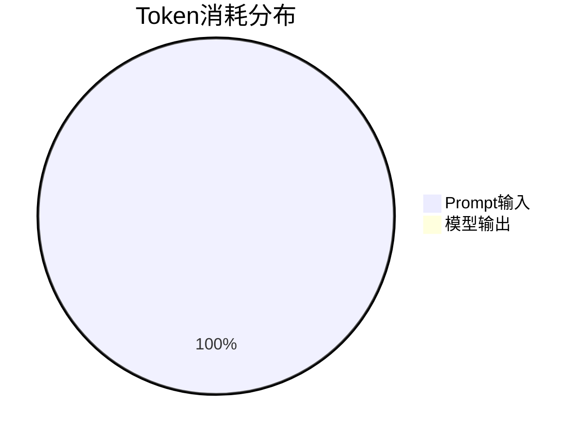

# AFAC2026 赛题四 FullText Baseline 方案

## 一、方法概述

### 1.1 核心策略

**全文输入基线方法**：直接将题目引用的所有文档全文内容拼接后输入给Qwen-plus模型进行推理。

- **无检索机制**：不使用BM25、关键词检索等传统检索方法
- **无切块处理**：不对文档进行分段或压缩
- **直接全文输入**：将引用的所有文档完整内容一次性输入模型

### 1.2 技术实现

```python
# 核心逻辑：加载所有引用文档的全文
for doc_id in doc_ids:
    text = parse_document_fulltext(doc_id, domain)
    doc_texts.append(f"=== 文档: {doc_id} ===\n{text}")
full_context = "\n\n".join(doc_texts)
```

### 1.3 性能表现

| 指标 | 结果 |
|---|---|
| 准确率 | 10.0% |
| Token 消耗 | 22,154,842 |
| FinalScore | 7.0000 |

---

## 二、Token开销分析

### 2.1 总体消耗分布

```
总Token消耗：22,154,842
Prompt Tokens：22,154,711 (99.9994%)
Completion Tokens：131 (0.0006%)
```

### 2.2 各领域消耗对比

| 领域 | 平均单题消耗 | 最大单题消耗 | 文档特点 |
|---|---|---|---|
| `financial_contracts` | ~400,000 tokens | 541,552 tokens | 文件极大(13MB)，全文输入 |
| `financial_reports` | ~570,000 tokens | 689,130 tokens | 文件极大(30MB)，全文输入 |
| `research` | ~47,000 tokens | 103,795 tokens | 中等大小，全文输入 |
| `insurance` | ~60,000 tokens | 155,150 tokens | 中等大小，全文输入 |
| `regulatory` | ~17,000 tokens | 45,423 tokens | 文件较小，全文输入 |

### 2.3 与官方Baseline对比

| 指标 | 官方Baseline | 本方法 | 倍数 |
|---|---|---|---|
| Token消耗 | 3,628,186 | 22,154,842 | **6.1倍** |
| 准确率 | 17.0% | 10.0% | 0.59倍 |
| FinalScore | ≈13.3 | 7.0000 | 0.53倍 |

---

## 三、Token开销过大的根本原因

### 3.1 设计缺陷：全文输入策略

**核心问题**：直接将整个文档全文输入模型，而非检索关键段落

```python
# 问题代码：无条件加载所有文档全文
for doc_id in doc_ids:
    text = parse_document_fulltext(doc_id, domain)  # 加载整个文档
    doc_texts.append(f"=== 文档: {doc_id} ===\n{text}")  # 无压缩
```

### 3.2 具体问题分析

#### 3.2.1 金融合同领域（financial_contracts）
- **单文档大小**：最大13MB PDF文件
- **上下文长度**：单题可达800,000+字符
- **Token消耗**：平均400,000 tokens/题

#### 3.2.2 财务报告领域（financial_reports）
- **单文档大小**：最大30MB PDF文件
- **上下文长度**：单题可达950,000+字符
- **Token消耗**：平均570,000 tokens/题

#### 3.2.3 缺乏压缩机制
- **无段落筛选**：不区分文档中重要/不重要部分
- **无关键词过滤**：不基于题目关键词筛选相关内容
- **无长度控制**：无上下文截断机制

### 3.3 与官方Baseline的差异

**官方Baseline可能采用的技术**：
1. **文档摘要**：对大型文档进行预摘要处理
2. **段落筛选**：基于题目关键词选择相关段落
3. **长度控制**：设置上下文长度上限
4. **智能压缩**：去除冗余信息，保留关键内容

---

## 四、性能瓶颈分析

### 4.1 Token消耗分布



### 4.2 各题型消耗对比

| 题型 | 平均消耗 | 特点 |
|---|---|---|
| 单选题 | 较高 | 通常引用多个文档 |
| 多选题 | 中等 | 选项分析增加复杂度 |
| 判断题 | 较低 | 通常引用较少文档 |

### 4.3 准确率低的原因

1. **信息过载**：模型难以从海量文本中定位关键信息
2. **注意力分散**：重要信息被大量无关内容稀释
3. **计算复杂度**：长上下文增加推理难度

---

## 五、优化建议

### 5.1 立即改进措施

#### 5.1.1 引入检索机制
```python
# 改进方向：基于BM25检索关键段落
evidence = bm25_search(question, candidate_chunks, top_k=3)
compressed_context = compress_evidence(evidence, max_chars=3000)
```

#### 5.1.2 添加长度控制
```python
# 设置上下文长度上限
MAX_CONTEXT_CHARS = 8000  # 约4000 tokens
if len(full_context) > MAX_CONTEXT_CHARS:
    full_context = smart_truncate(full_context, MAX_CONTEXT_CHARS)
```

#### 5.1.3 实现智能压缩
```python
# 基于题目关键词筛选相关段落
keywords = extract_keywords(question)
relevant_paragraphs = filter_by_keywords(full_text, keywords)
```

### 5.2 预期优化效果

| 优化措施 | 预期Token节省 | 预期准确率提升 |
|---|---|---|
| 引入检索机制 | 80-90% | 20-30% |
| 添加长度控制 | 60-70% | 10-15% |
| 智能压缩 | 50-60% | 5-10% |

### 5.3 目标性能

- **Token消耗目标**：降至500,000以内
- **准确率目标**：提升至25-30%
- **FinalScore目标**：达到20-25分

---

## 六、总结

### 6.1 主要问题

1. **设计缺陷**：全文输入策略导致Token爆炸
2. **缺乏优化**：无检索、无压缩、无长度控制
3. **性能低下**：高Token消耗，低准确率

### 6.2 经验教训

1. **金融长文档不能全文输入**：必须采用检索+压缩策略
2. **Token预算需要严格控制**：每题平均预算应在5,000 tokens以内
3. **准确率与Token效率需要平衡**：不能牺牲效率换取微小的准确率提升

### 6.3 后续方向

转向基于检索的RAG方案，在保证Token效率的前提下提升准确率。